# FPVSoundLogger
A DIY RP2040-Zero based onboard audio recorder for FPV drones. It uses a MEMS mic and SD card module to capture sound, automatically triggered by Betaflight arming via PinioBox. Recordings match DJI goggles video length for seamless editing. Includes hardware design, MicroPython code, and examples.


###### Enjoy this project or find it useful? Feel free to buy me a coffee ☕ to support its development. [](https://www.paypal.com/donate/?business=9KPSWRNY9UFYL&no_recurring=0&item_name=Enjoy+this+project+or+find+it+useful?+Feel+free+to+buy+me+a+coffee+%E2%98%95+to+support+its+development.&currency_code=EUR)


## Project Background

I first started experimenting with the excellent and promising [OpenIPC](https://github.com/openipc) project, driven by my love for tinkering, hacking, and coding. The idea of building an open FPV video system was incredibly appealing.
But after many tests, the freeze issues and limited range eventually convinced me to switch to DJI for reliable everyday flying.
(But I promise — I’ll come back to OpenIPC!)

The DJI O4 Air Unit provides fantastic onboard video recordings.
But (because there's always a “but”), it still doesn’t record audio. And audio truly adds something special — whether for aggressive FPV flying or even some cinematic flights.

So I wanted a solution that would be simple/lightweight/inexpensive and capable of recording high‑quality audio and perfectly* synchronized with DJI recordings.
This project is the result of that idea.

##### Démo
[](https://on.soundcloud.com/oyk3qiLrCShgnDtLTU)
[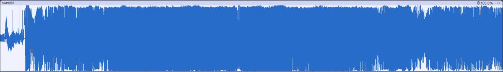](resources/audio/sample.wav)


## Features
- Autonomous module
- Work with [Betaflight](https://github.com/betaflight/betaflight)/[INAV](https://github.com/iNavFlight/inav) 
- Enable/disable recording
- Auto record using arm/disarm trigger
- Audio/video share the same duration*

## Prerequisites

- A flight controller running **[Betaflight](https://github.com/betaflight/betaflight)**/**[INAV](https://github.com/iNavFlight/inav)** with at least two available Pinio outputs
- A transmitter (TX) capable of assigning **AUX channels** (EdgeTX, OpenTX, etc.)
- A stable **3.3V** output on the flight controller and a **common ground**
- A free **switch** or similar to toggle recording modes
- Basic soldering tools for connecting power, ground, and signal wires and plenty of flux — <u>***flux is life***</u>

## How It Works

- Power up the drone — In **Disable** mode module's LED **Red** blinking
- Use one of your TX switches to **Enable** recording mode — the LED now blinks **Green**
- **Arm your drone**: the module immediately starts **writing audio data** to the SD card, and the LED turns solid **Green**
- **Once disarmed** — whether after a normal end of flight or a dramatic crash — the module **stops recording** and finalizes the audio file with the proper header
- Remove the SD card and retrieve the **WAV file** that matches the exact flight duration
- Import the audio into your favorite video editor and drop it on the timeline — it syncs effortlessly with the DJI footage !
> **⚠️ Fine-tuning tip:** Due to DJI's camera initialization delay after arming, 
> you may need to offset the audio track by **0.5-2 seconds** in your editor. 

**Format:** `rec_XXXX_MM-SS.wav`
- 🔵 **Index (XXXX)**: Auto-incremented counter (0001, 0002, 0003...)
- 🟡 **Duration (MM-SS)**: Recording length in minutes and seconds

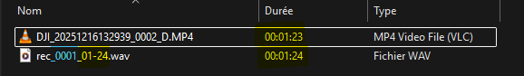

## Architecture / Hardware Overview

### Components

|  | INMP441 | RP2040-Zero | SD Card SPI Module |
| - | :-------: | :-----------: | :-------------: |
| |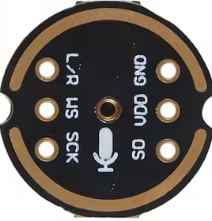 | 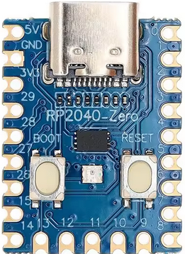 | 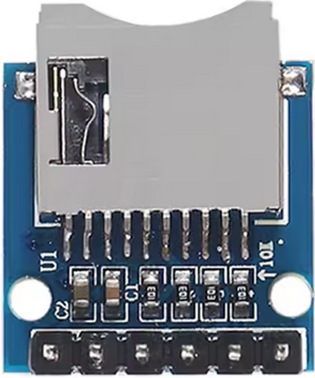 |
| Description | The INMP441 is a compact digital MEMS microphone that outputs audio through an I²S interface.It delivers low‑noise, high‑quality audio capture with a built‑in amplifier and ADC | The Raspberry Pi Pico uses the RP2040 dual‑core ARM Cortex‑M0+ microcontroller running at up to 133 MHz with 264 KB RAM and 2 MB flash.It offers rich connectivity like I²C, SPI, UART, PWM, ADC, and powerful PIO blocks for custom protocols.Compact, low‑cost, and easy to program in **MicroPython** or C/C++.| Micro SD TF Card Memory Shield Module provides an easy way to add microSD storage to microcontrollers.It uses an onboard card socket and level shifting for safe 3.3 V–5 V operation.Ideal for large dataqqsets via SPI. |
| Size | 12x14mm | 18x24.5mm | 18x21mm |
| Weight | 0.36gr | 1.66gr | 1.46gr |
| AliExpress | [INMP441](https://www.aliexpress.com/item/1005007889064664.html?spm=a2g0o.order_list.order_list_main.142.32325e5blt8IZ0) | [RP20240-Zero](https://www.aliexpress.com/item/1005007650325892.html?spm=a2g0o.order_list.order_list_main.147.32325e5blt8IZ0) | [SD TF Module](https://www.aliexpress.com/item/1005005591145849.html?spm=a2g0o.order_list.order_list_main.152.32325e5blt8IZ0) |

### Wiring
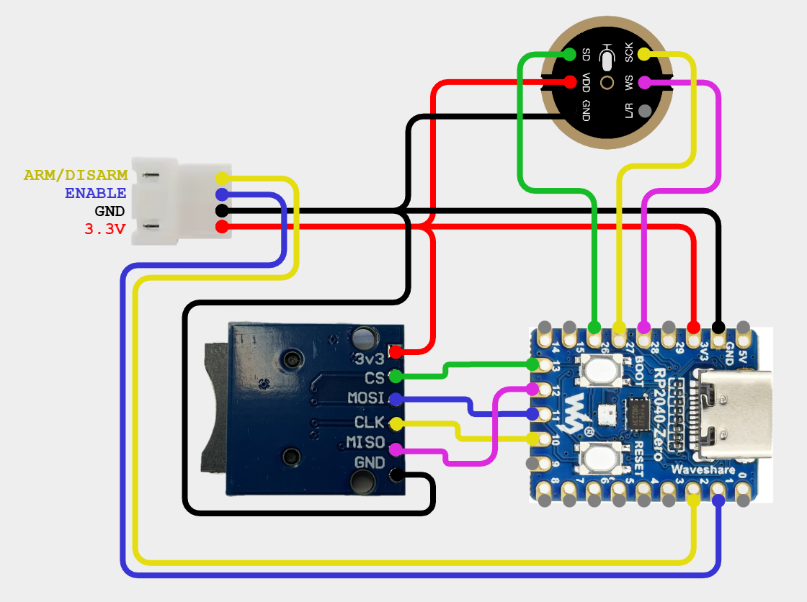

### Alternatives
An alternative is to use the FC’s 5 V rail to power the Pi Pico. The SD Card SPI module can convert data signals to 3.3 V levels, allowing it to use the Pi Pico’s 5 V rail. However, according to the [INMP441](resources/datasheet/INMP441.pdf) datasheet, the maximum supply voltage must not exceed 3.63 V, so **you must power it from the Pi Pico’s 3.3 V rail**.

## Build 

In the interest of keeping things lightweight and considering the very low current required for the system to operate, 28‑AWG silicone cable is more than sufficient, and you shouldn’t add more than 1 g to the whole setup.I cut and glued a small foam circle — the kind you find at the bottom of FC/ESC boxes, as dense as possible — to make a windscreen/pop filter.

Be careful not to get any glue into the microphone’s input opening.To keep everything in place, I used a ridiculously heavy piece of heat‑shrink tubing to “thermal‑zipper” the whole thing, along with a bit of hot glue (B7000 is obviously the best option, though hard to find) to secure the small 4‑pin JST connector against the assembly.

In my rough version installed in my Jeno 5", the module weighs about 10 g, but it’s definitely possible to do much better.

A voltage spike can cause parasitic artifacts in the recording. I haven’t tested this yet, but as mentioned in the [INMP441](resources/datasheet/INMP441.pdf) datasheet it is recommended to use a small 0.1 µF ceramic capacitor between VDD and GND.

##### Examples
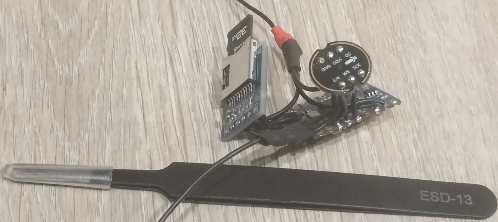
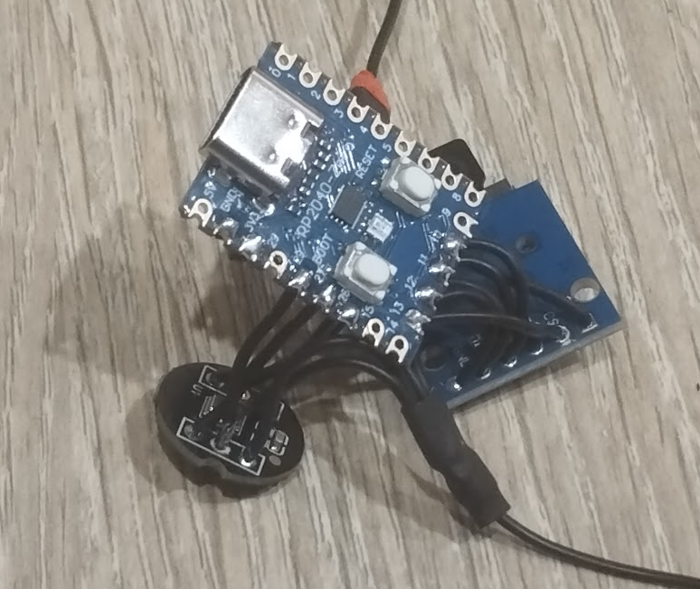


## Installation & Configuration

### Pi Pico: Flashing MicroPython on an RP2040 with Thonny

##### 1. Install Thonny
- Download and install [Thonny](https://thonny.org/) from the official website.  
- Open [Thonny](https://thonny.org/).

##### 2. Put the RP2040 board into bootloader mode
- Plug in the board **while holding the BOOTSEL button**.  
- Release the button once connected: the board should appear as a USB drive named **RPI-RP2**.

##### 3. Install MicroPython from [Thonny](https://thonny.org/)
- In Thonny, go to:  
  **Tools → Options… → Interpreter**  
- Select:  
  **MicroPython (Raspberry Pi Pico / RP2040)**  
- Click **Install or update MicroPython**.  
- Select your **RPI-RP2** device.  
- Start the installation.


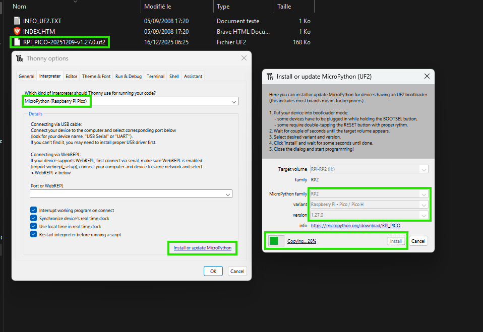

##### 4. Automatic restart
The board will reboot with MicroPython installed.  
[Thonny](https://thonny.org/) should now display a `>>>` prompt.

##### 5. Quick test
Type:

```python
print(f"WE ARE {'fpv'.upper()}")
```

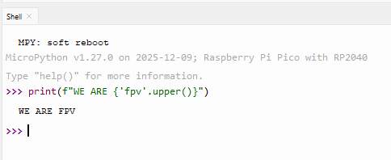

##### 6. Project files to upload
```
├── main.py                    # Main application (auto-runs on boot)
   └── lib/
       ├── sdcard.py              # SD card driver
       └── fpv_sound_logger.py    # Core logger class
```

- In Thonny, go to **View > Files**
- In your computer's file panel (left side), navigate to your project folder
- Select the `lib` folder
- Right-click → **"Upload to /"**
- Then select `main.py`
- Right-click → **"Upload to /"**
- Thonny will upload the entire structure automatically

> **Note:** This method preserves the folder structure. The `lib` folder and its contents will be uploaded correctly.
<p align="left">
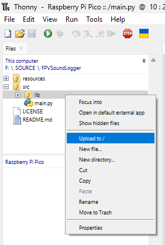
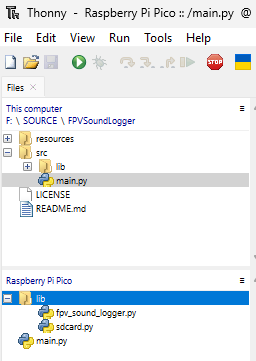
</p>

### TX && Betaflight configuration

All you need to know about Betaflight's Pinio && PinioBox can be found [here](https://www.betaflight.com/docs/wiki/guides/current/Pinio-and-PinioBox), I also got some excellent advice from Betaflight’s [official discord](https://discord.betaflight.com/)

- You'll need to configure AUX channel on your TX to Enable/Disable recording

    > I configured it to use the center position of an three-position switch mapped to AUX6 on my Radiomaster Pocket running on EdgeTX.

- Provide a **common ground** from the flight controller to the module, along with a clean **3.3V** or [5V supply](#Alternatives)

    > On my JHEMCU GF20F722, I used the 3.3V rail that was originally intended for a DSM receiver.

- Configure your flight controller’s Pinio outputs using CLI to deliver the required logic levels:

    - One Pinio controls record enable/disable

    - The second Pinio follows the arm/disarm sequence to automatically start and stop recording.

    > [...]
    > 
    > resource pinio 1 B10          # remap RX3 pad
    > 
    > resource pinio 2 B11          # remap TX3 pad
    > 
    > set pinio_config = 1,129,1,1  # High level for _pinio 1_ and inverted for _pinio 2_
    > 
    > set pinio_box = 40,0,255,255  # ID 40 mean BOXUSER1 and ID 0 Arm/Disarms

- Configure a new mode for USER1

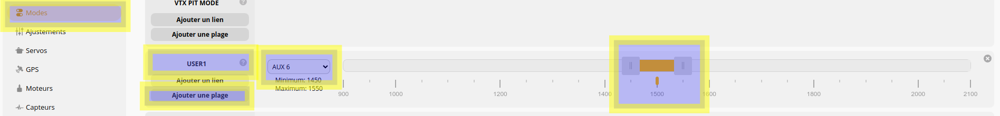

### For testing purposes

Even if the 3.3 V or 5 V rail used to power the recorder is active while [Betaflight](https://github.com/betaflight/betaflight) is connected via USB, you still won’t be able to start the recording. The [Betaflight](https://github.com/betaflight/betaflight) safety flags will prevent the drone from arming.

Because of this, even with the ***MOTOR_STOP*** option enabled in the Motors tab, the brushless motors may still start spinning. As a result, you will always have motor or propeller noise in your recordings — never any silence. And if you need to speak into the microphone, **be careful**… or make sure to shout loud enough! ^^


